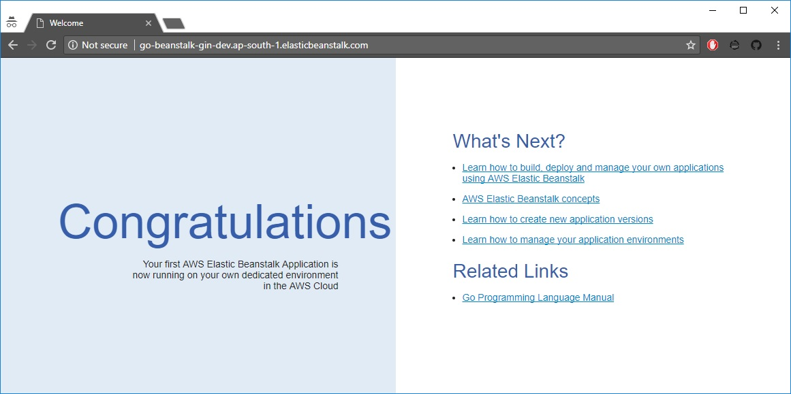

## Deploy to Elastic Beanstalk

1. [Environment setup](#environment-setup)
1. [`eb init`](#eb-init)
1. [`eb create`](#eb-create)
1. [Load port from environment](#load-port-from-environment)
1. [Buildfile](#buildfile)
1. [gin `release` mode](#gin_release_mode)
1. [`eb deploy`](#eb-deploy)

After you have completed all the steps, your repo should look something like
this - [`deploy-to-elastic-beanstalk`]

### Environment setup

Install the Elastic Beanstalk command line tool using the instructions
described here -
http://docs.aws.amazon.com/elasticbeanstalk/latest/dg/eb-cli3-install.html.
After installing the `eb` CLI, when we initialise our first application, it
will request the access and secret key so that it can manage resources for us.

### `eb init`

Let us initialise our application. This sets the region and platform for our
application among other configuration options:

```
$ eb init

Select a default region
1) us-east-1 : US East (N. Virginia)
2) us-west-1 : US West (N. California)
3) us-west-2 : US West (Oregon)
4) eu-west-1 : EU (Ireland)
5) eu-central-1 : EU (Frankfurt)
6) ap-south-1 : Asia Pacific (Mumbai)
7) ap-southeast-1 : Asia Pacific (Singapore)
8) ap-southeast-2 : Asia Pacific (Sydney)
9) ap-northeast-1 : Asia Pacific (Tokyo)
10) ap-northeast-2 : Asia Pacific (Seoul)
11) sa-east-1 : South America (Sao Paulo)
12) cn-north-1 : China (Beijing)
13) us-east-2 : US East (Ohio)
14) ca-central-1 : Canada (Central)
15) eu-west-2 : EU (London)
(default is 3): 6

Enter Application Name
(default is "go-beanstalk-gin"):
Application go-beanstalk-gin has been created.

Select a platform.
1) Tomcat
2) Java
3) IIS
4) PHP
5) Ruby
6) Python
7) Go
8) Docker
9) GlassFish
10) Node.js
11) Packer
(default is 1): 7

Select a platform version.
1) Go 1.9
2) Go 1.8
3) Go 1.6
4) Go 1.5
5) Go 1.4 (Preconfigured - Docker)
6) Go 1.3 (Preconfigured - Docker)
(default is 1): 1
Note: Elastic Beanstalk now supports AWS CodeCommit; a fully-managed source control service. To learn more, see Docs: https://aws.amazon.com/codecommit/
Do you wish to continue with CodeCommit? (y/N) (default is n): n
Do you want to set up SSH for your instances?
(Y/n): y

Type a keypair name.
(Default is aws-eb):
Generating public/private rsa key pair.
Enter passphrase (empty for no passphrase):
Enter same passphrase again:
Your identification has been saved in C:\Users\suhas.karanth\.ssh\aws-eb.
Your public key has been saved in C:\Users\suhas.karanth\.ssh\aws-eb.pub.
The key fingerprint is:
SHA256:DibPU6XGGVMJaigm0iUfhf75hwpZfVUKqVLX3hDTdWY aws-eb
The key's randomart image is:
+---[RSA 2048]----+
|  . oo. ..o+oo..E|
| . +.o ...+.o+.o.|
|o +.o o.oo..oo   |
|.o ....o.* .. .  |
|    ..+oS .      |
|     Bo= .       |
|    o +...       |
|     . .o .      |
|      .. .       |
+----[SHA256]-----+
WARNING: Uploaded SSH public key for "aws-eb" into EC2 for region ap-south-1.
```

In this step, `eb` creates a folder `.elasticbeanstalk` for Elastic Beanstalk
configuration files. The `config.yml` file would look something like this:

```yml
branch-defaults:
  master:
    environment: null
    group_suffix: null
global:
  application_name: go-beanstalk-gin
  branch: null
  default_ec2_keyname: aws-eb
  default_platform: Go 1.9
  default_region: ap-south-1
  include_git_submodules: true
  instance_profile: null
  platform_name: null
  platform_version: null
  profile: eb-cli
  repository: null
  sc: git
  workspace_type: Application

```

It also adds the following to our `.gitignore`:

```diff
@@ -21,3 +21,13 @@ vendor.orig
 _vendor-*

 **/*.log
+
+
+# Elastic Beanstalk Files
+
+.elasticbeanstalk/*
+
+!.elasticbeanstalk/*.cfg.yml
+
+!.elasticbeanstalk/*.global.yml
+
```

Oddly enough, although these rules should ignore the newly created file
`.elasticbeanstalk/config.yml`, it does not:

```shell
git status
On branch master
Your branch is up-to-date with 'origin/master'.

Changes not staged for commit:
  (use "git add <file>..." to update what will be committed)
  (use "git checkout -- <file>..." to discard changes in working directory)

        modified:   .gitignore

Untracked files:
  (use "git add <file>..." to include in what will be committed)

        .elasticbeanstalk/

no changes added to commit (use "git add" and/or "git commit -a")
```

However, if we make any changes to `.gitignore`, the file gets ignored. Maybe a
`git` bug?

### `eb create`

The next step is to create an environment for our application.

Command line flags:
* **`--single`** - Use a single instance with no load balancer. _This is only a
  demo and we do not need high availability_.
* **`--sample`** - Deploy a sample application. _Our webapp isn't ready to be
  deployed to Elastic Beanstalk yet_.

```shell
$ eb create --single --sample
Enter Environment Name
(default is go-beanstalk-gin-dev):
Enter DNS CNAME prefix
(default is go-beanstalk-gin-dev):
Environment details for: go-beanstalk-gin-dev
  Application name: go-beanstalk-gin
  Region: ap-south-1
  Deployed Version: Sample Application
  Environment ID: e-xxxxxxxxxx
  Platform: arn:aws:elasticbeanstalk:ap-south-1::platform/Go 1 running on 64bit Amazon Linux/2.7.0
  Tier: WebServer-Standard
  CNAME: go-beanstalk-gin-dev.ap-south-1.elasticbeanstalk.com
  Updated: 2017-11-03 03:21:26.605000+00:00
Printing Status:
INFO: createEnvironment is starting.
INFO: Using elasticbeanstalk-ap-south-1-XXXXXXXXXXXX as Amazon S3 storage bucket for environment data.
INFO: Created security group named: awseb-e-xxxxxxxxxx-stack-AWSEBSecurityGroup-XXXXXXXXXXXX
INFO: Created EIP: xx.xxx.xx.xxx
INFO: Environment health has transitioned to Pending. Initialization in progress (running for 8 seconds). There are no instances.
INFO: Waiting for EC2 instances to launch. This may take a few minutes.
INFO: Added instance [i-XXXXXXXXXXXXXXXXX] to your environment.
INFO: Successfully launched environment: go-beanstalk-gin-dev
```

You should be able to see something like this after the application is deployed:



### Load port from environment

By default, Elastic Beanstalk configures the nginx proxy to forward requests to
our application on port `5000`. We can override the default port by setting the
`PORT` environment property to the port on which our main application listens.
So let us modify `application.go` to load the `port` from the environment and
default to `5000` otherwise:

```diff
@@ -1,6 +1,9 @@
 package main

 import (
+	"log"
+	"os"
+
 	"github.com/gin-gonic/gin"
 )

@@ -53,6 +56,11 @@ func main() {
 		}
 	})

-	// Listen and Server in 0.0.0.0:8080
-	r.Run(":8080")
+	// Listen and Server in 0.0.0.0:$PORT
+	port := os.Getenv("PORT")
+	if port == "" {
+		port = "5000"
+	}
+	err := r.Run(":" + port)
+	log.Panic(err)
 }
```

### Buildfile

Our application is pretty close to complete. However, deployment will still
fail on Elastic Beanstalk because the default build process does not know how
to resolve `github.com/gin-gonic/gin`:

```
-------------------------------------
/var/log/eb-activity.log
-------------------------------------
  Executing: HOME=/tmp /opt/elasticbeanstalk/lib/ruby/bin/ruby /opt/elasticbeanstalk/lib/ruby/bin/foreman start --procfile /tmp/d20171103-4233-13fd16n/eb-buildtask-0 --root /var/app/staging --env /var/elasticbeanstalk/staging/elasticbeanstalk.env
  03:50:15 build.1 | started with pid 4246
  03:50:15 build.1 | application.go:7:2: cannot find package "github.com/gin-gonic/gin" in any of:
  03:50:15 build.1 | 	/opt/elasticbeanstalk/lib/go/src/github.com/gin-gonic/gin (from $GOROOT)
  03:50:15 build.1 | 	/var/app/current/src/github.com/gin-gonic/gin (from $GOPATH)
  03:50:15 build.1 | exited with code 1
  03:50:15 system  | sending SIGTERM to all processes
```

Even if we ask `eb` to package our `vendor` directory, the build still fails
with the same error because our staging directory, `/var/app/staging`, is not
within the `$GOPATH`. You can view these environment properties from
`Configuration > Software Configuration > Environment Properties`. I tried
setting `APP_STAGING_DIR` to `/var/app/staging/src/go-beanstalk-gin` but that
didn't help either. Maybe because the folder structure did not exist.

The solution is to add a `Buildfile` to take control of the build process.
Docs - http://docs.aws.amazon.com/elasticbeanstalk/latest/dg/go-buildfile.html.

The build process need to do the following:

* Download a versioned release of `dep` if required.
* Setup a temporary Go workspace and move our files to a project under it.
* Install dependencies using `dep ensure`.
* Build the application and also specify [build tags for `jsoniter`].
* Move the binary we built back to `APP_STAGING_DIR`.

You can see the relevant commit, [`d0eafa7`], which sets up the build process.

**Important:** The file `build.sh` should be executable. On *nix, it can be made
executable by modifying the relevant permissons before committing it:

```shell
$ chmod +x build.sh
```

On windows, since files do not have permissions, we need to ask `git` to do it
for us:

```
λ git add Buildfile build.sh

λ git update-index --chmod=+x build.sh

λ git commit -m "build: Setup build script for Elastic Beanstalk"
[master d0eafa7] build: Setup build script for Elastic Beanstalk
 2 files changed, 53 insertions(+)
 create mode 100644 Buildfile
 create mode 100755 build.sh
```

### gin `release` mode

When we run our app, it prints the following warning:

```
[GIN-debug] [WARNING] Running in "debug" mode. Switch to "release" mode in production.
 - using env:   export GIN_MODE=release
 - using code:  gin.SetMode(gin.ReleaseMode)
```

So let us configure the environment for our webapp to run it in `release` mode:

```
$ eb setenv GIN_MODE=release
INFO: Environment update is starting.
INFO: Updating environment go-beanstalk-gin-dev's configuration settings.
WARN: Process termination taking longer than 10 seconds.
INFO: Successfully deployed new configuration to environment.

$ eb printenv
 Environment Variables:
     APP_DEPLOY_DIR = /var/app/current
     APP_STAGING_DIR = /var/app/staging
     GIN_MODE = release
     GOPATH = /var/app/current
     PATH = /bin:/usr/bin:/usr/sbin:/usr/local/bin:/usr/local/sbin:/usr/local/go/bin:/var/app/current
```

We can also achieve this through [`.ebextensions`]. Add a file
`.ebextensions/options.config` in the root of the project with the following
content:

```yml
option_settings:
  aws:elasticbeanstalk:application:environment:
    GIN_MODE: release

```

### `eb deploy`

Our application is now ready to be deployed!

```shell
$ eb deploy
Creating application version archive "app-create-gin-webapp-4-gcd8b-171103_103951".
Uploading go-beanstalk-gin/app-create-gin-webapp-4-gcd8b-171103_103951.zip to S3. This may take a while.
Upload Complete.
INFO: Environment update is starting.
INFO: Deploying new version to instance(s).
WARN: Process termination taking longer than 10 seconds.
INFO: Environment health has transitioned from Degraded to Info. Application update in progress on 1 instance. 0 out of 1 instance completed (running for 59 seconds).
INFO: New application version was deployed to running EC2 instances.
INFO: Environment update completed successfully.

$ curl -v http://go-beanstalk-gin-dev.ap-south-1.elasticbeanstalk.com/ping
* STATE: INIT => CONNECT handle 0x20082ca0; line 1407 (connection #-5000)
* Added connection 0. The cache now contains 1 members
*   Trying xx.xxx.xx.xxx...
* TCP_NODELAY set
* STATE: CONNECT => WAITCONNECT handle 0x20082ca0; line 1460 (connection #0)
* Connected to go-beanstalk-gin-dev.ap-south-1.elasticbeanstalk.com (xx.xxx.xx.xxx) port 80 (#0)
* STATE: WAITCONNECT => SENDPROTOCONNECT handle 0x20082ca0; line 1567 (connection #0)
* Marked for [keep alive]: HTTP default
* STATE: SENDPROTOCONNECT => DO handle 0x20082ca0; line 1585 (connection #0)
> GET /ping HTTP/1.1
> Host: go-beanstalk-gin-dev.ap-south-1.elasticbeanstalk.com
> User-Agent: curl/7.51.0
> Accept: */*
>
* STATE: DO => DO_DONE handle 0x20082ca0; line 1664 (connection #0)
* STATE: DO_DONE => WAITPERFORM handle 0x20082ca0; line 1791 (connection #0)
* STATE: WAITPERFORM => PERFORM handle 0x20082ca0; line 1801 (connection #0)
* HTTP 1.1 or later with persistent connection, pipelining supported
< HTTP/1.1 200 OK
* Server nginx/1.12.1 is not blacklisted
< Server: nginx/1.12.1
< Date: Fri, 03 Nov 2017 05:14:08 GMT
< Content-Type: text/plain; charset=utf-8
< Content-Length: 4
< Connection: keep-alive
<
* STATE: PERFORM => DONE handle 0x20082ca0; line 1965 (connection #0)
* multi_done
* Curl_http_done: called premature == 0
* Connection #0 to host go-beanstalk-gin-dev.ap-south-1.elasticbeanstalk.com left intact
* Expire cleared
pong
```

[`deploy-to-elastic-beanstalk`]: https://github.com/sudo-suhas/go-beanstalk-gin/tree/deploy-to-elastic-beanstalk
[build tags for `jsoniter`]: https://github.com/gin-gonic/gin#build-with-jsoniter
[`d0eafa7`]: https://github.com/sudo-suhas/go-beanstalk-gin/commit/d0eafa7
[`.ebextensions`]: http://docs.aws.amazon.com/elasticbeanstalk/latest/dg/ebextensions.html
